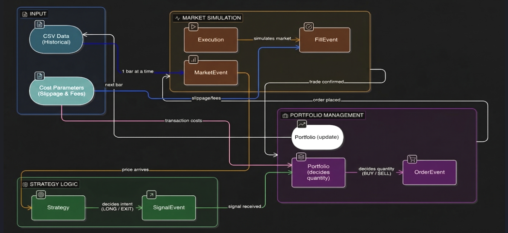

# Event-Driven Backtesting Engine

This project implements a quantitative event-driven backtesting engine from scratch.
The system is designed with strict time causality and clear separation between data,
strategy, portfolio, and execution components.

Initial focus is on correctness and architecture before adding realism and performance metrics.




## Assumptions of this Backtesting Engine

### Market & Data Assumptions

* The system operates on **interday (daily OHLCV) data**
* Each candle represents one complete trading day
* Data source: Yahoo Finance (or equivalent)
* Missing data points are removed during preprocessing

### Asset Scope

* Supports **single equity (stock) backtesting**
* No multi-asset portfolio (currently)
* No derivatives (options, futures)

### Execution Assumptions

* **Next-bar execution model**:

  * Signals generated at time *t*
  * Executed at **OPEN price of time t+1**
* No intraday execution (no tick/minute-level simulation)
* Orders are assumed to be **market orders**

### Transaction Costs & Slippage

* Slippage is modeled as a **percentage impact on price**
* Transaction cost is applied as a **percentage of trade value**
* Both are user-configurable
* Default values: 0.0 (can be adjusted)

### Portfolio Assumptions

* Single position at a time (no multiple concurrent positions)
* Capital is updated after each trade
* No leverage or margin trading
* No short selling (long-only system)

### Strategy Assumptions

* Strategies are **event-driven**
* Signals are based only on **historical data up to time t**
* No future data is used (no look-ahead bias)

### Risk & Positioning

* Basic position sizing (capital-based)
* Optional stop-loss and take-profit (if enabled)
* No advanced risk models (VaR, hedging, etc.)

### Performance Evaluation

* Metrics include:

  * Total Return
  * Sharpe Ratio
  * Drawdown
* Evaluation performed on both:

  * In-Sample (Train)
  * Out-of-Sample (Test)

### Limitations

* Does not simulate order book depth or liquidity
* Does not include latency or execution delay beyond next-bar
* Assumes sufficient market liquidity for all trades

## How to Add a New Strategy

Follow these steps to integrate a new trading strategy into the framework.

---

### Step 1: Create a New Strategy File

Create a new file inside the `strategy/` folder:

```
strategy/my_strategy.py
```

---

### Step 2: Use This Template

```
from collections import deque
from events.events import SignalEvent

class MyStrategy:

    def __init__(self, events, symbol):
        self.events = events
        self.symbol = symbol

        self.prices = deque(maxlen=20)
        self.in_market = False

    def calculate_signals(self, event):

        if event.symbol != self.symbol:
            return

        self.prices.append(event.close)

        if len(self.prices) < 20:
            return

        # ---- STRATEGY LOGIC ----
        if not self.in_market:
            self.events.put(SignalEvent(self.symbol, event.time, "LONG"))
            self.in_market = True

        elif self.in_market:
            self.events.put(SignalEvent(self.symbol, event.time, "EXIT"))
            self.in_market = False
```

---

### Step 3: Ensure Registry Picks It Up

* The system automatically loads strategies from the `strategy/` folder
* No manual registration needed (if using dynamic loader)

---

### Step 4: Run from UI

* Open Streamlit app
* Select your strategy from dropdown
* Run backtest

---

## Important Guidelines

### 1. No Look-Ahead Bias

* Use only past data (`event.close`, historical values)
* Never use future prices

### 2. Maintain State Properly

* Track whether you are in a position (`self.in_market`)
* Avoid duplicate signals

### 3. Keep Logic Lightweight

* Strategy should only generate signals
* Do NOT handle execution or portfolio logic

### 4. Use Event System Correctly

* Only emit:

  * `"LONG"` → enter position
  * `"EXIT"` → close position

### 5. Avoid Over-Trading

* Add conditions to prevent frequent buy/sell noise

### 6. Parameter Simplicity

* Use fixed parameters initially
* Avoid optimization inside strategy

---

## Best Practices

* Test strategy on multiple stocks
* Compare against benchmark (buy & hold)
* Use realistic slippage & transaction costs
* Validate on out-of-sample data

---

## Common Mistakes to Avoid

* Using current candle future values
* Generating signals every tick without condition
* Mixing execution logic inside strategy
* Ignoring transaction costs impact

---

## Summary

A strategy should:

* Be independent
* Be data-driven
* Generate only signals
* Be easily pluggable into the engine


